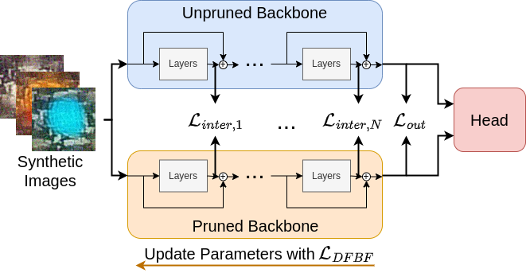

# Data-Free Backbone Fine-Tuning for Pruned Neural Networks


**[Data-Free Backbone Fine-Tuning for Pruned Neural Networks](https://arxiv.org/abs/2306.12881)**<br />
This is the official project page of our paper.<br />
Adrian Holzbock, Achyut Hegde, Klaus Dietmayer, and Vasileios Belagiannis<br />
Accepted at the 31st European Signal Processing Conference (EUSIPCO), September 4-8 2023, Helsinki, Finland<br />

<br />

<div align="center">

</div>

<br />


## Requirements

We added the [Dockerfile](./Dockerfile) for an easy execution of our code. To run the docker, do the following steps:
- To build the docker container, navigate to the directory and execute: `docker build -t pruning:latest .` 
- You can run the container by executing: `run_docker.sh` 
- In the container, navigate to `/workspace/` to run a script.


## Directory Structure

```shell
│
└───data
└───data-mscoco
│   └───annotations
│   └───images
│   └───test2017
│   └───train2017
│   └───val2017
└───data-voc
│   └───VOC2007
│   └───VOC2012
└───pretrained_parameters
│   └───mmdet_config
│   │...
└───models_pruned
└───runs
│   └───exp_0
│   └───...
│README.md
│...
```

## Datasets
Our work uses the CIFAR10, the MS COCO, and the Pascal VOC dataset.

### CIFAR10
If you execute a training on CIFAR10 the first time, the dataset is downloaded to `./data/` automatically.

### MS COCO
Place the annotations and images directory of the dataset into the `data-mscoco` folder. Create the symlinks `test2017`, `train2017`, and `val2017` to the directories in the images folder. 

### Pascal VOC
Place the data of the subsets in the corresponding directories.

## Pre-Trained Model Parameters
We provide the pre-trained model weights on [Google Drive](https://drive.google.com/drive/folders/1CVX6KaMcl02ySzT42f1fc2Gsdu1DVTGT?usp=sharing). Download the files and put them into the `pretrained_parameters` directory.

## Model Pruning
Verify that you prepared your environment and the datasets in the right manner. In [run.sh](./run.sh), we provide execution commands for the different tasks and network architectures. All pruning runs are executed in the file with a pruning sparsity of 0.1 or 0.5. If you want a specific pruning sparsity, you must change the `--sparsity` parameter. The pruned and fine-tuned models are saved in the [runs](./runs/) directory. The `results.txt` file in the corresponding directory gives the model's final performance.


## Citation
If you use DFBF in your work or refer to our results in your paper, please cite the following work:
```latex
@article{holzbock2023data,
  title={Data-Free Backbone Fine-Tuning for Pruned Neural Networks},
  author={Holzbock, Adrian and Hegde, Achyut and Dietmayer, Klaus and Belagiannis, Vasileios},
  journal={arXiv preprint arXiv:2306.12881},
  year={2023}
}
```
